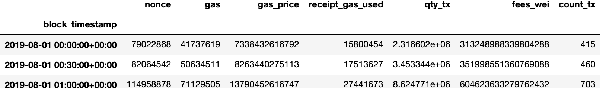

# Data Science Capstone Project: Bitcoin vs Tether
This repository contains my Capstone Project completed during General Assembly's Data Science Immersive.

### 1.a Introduction to crypto terminology: coins spec
Find as follow basic knowladge and facts about the coins and their realted blockchains:


### 1.b Stablecoins definition

Stabilise the price of the “coin” by linking its value to the value of one asset or a pool of assets. We can identify the following categories:

- Fiat-Backed Stablecoins: Tether
- Crypto-Collateralized Stablecoins: EOSTD / DAI
- Commodities-backed Stablecoins: Digix - Non-Collateralized:

### 2 Project Goal

The aim of the project is to investigate a possible relationship between Tether coin, which is a stablecoin paged to the dollar, and the quantity of Bitcoin that has been transacted during the same period.

Period taken in consideration:

- From: 1-Aug-2019
- To: 31-Aug-2019

Given the definition of stablecoin itself, USDT is thought to be used as hedging instrument in the following market conditions:

- **High volatility:** stablecoins allow you to transfer assets in a digital eco-system with no exposure to change in values

- **High correlation**: stablecoins allow you to manage your position 
- **Short Term borrowing**

### 3 Data collection

The data are available in the blockchains. It is feasible to connect to the blockchain network and look for specific information, moreover there are few drawbacks with processing time one of the most problematic.

I have to implement different approaches to compromise with these obstacles:

#### 3.a Tether from Ethereum Blockchain

To interact with any blockchain you need to manage your own node or connect to an existing node which is part of the blockchain.

###### 3.a.1 Connect to Infura node using Web3 python library

```python
from web3 import Web3
# CONNECT
web3 = Web3(Web3.HTTPProvider("https://mainnet.infura.io/c4674c2dfb9c4d62b92e662e1ef762db"))
web3.isConnected()
```

######  3.a.2 Filter for Tether transactions: 

Once connected to the node you can retrieve blocks IDs and their transactions.

After putting the Tx numbers in a python list you can filter for the Tether smart contract number:

``` python
# USDC = 0xa0b86991c6218b36c1d19d4a2e9eb0ce3606eb48
usdt_tx_list =[]
for b in range(0,200):
    for i in range(0, len(tx[b])):
        sc_address = web3.eth.getTransaction(tx[b][i].hex())['to']
         # Tether
        if sc_address =="0xdAC17F958D2ee523a2206206994597C13D831ec7":
            usdt_tx_list.append(tx[b][i])
```

###### 3.a.3 Get information contained in each Tether transaction:

Once we have the list of transactions we can then retrieve the content

``` python
usdt_tx_data = []
for row in range(0, len(usdt_tx_list)):
    usdt_tx_data.append(web3.eth.getTransaction(usdt_tx_list[row]))
    #time.sleep(random.normalvariate(3, 0.3))
usdt_tx_data`
```

This step allows us to get inside each Tether transaction and retrieve the information:

- Transaction infirmation

```
AttributeDict({'blockHash': HexBytes('0x2994bdaa2fcd0e1c4d8b854cdb949cb65bdb696ef1243a7df799c8c23ff492d6'),
  'blockNumber': 8962395,
  'from': '0xd8e15C71964B05FFA0884C9Fa21E19F7A3c6449D',
  'gas': 220000,
  'gasPrice': 35000000000,
  'hash': HexBytes('0x38de8c3a68757609dafc4476b3eb9aa9817a67c2ec407668a44a4cfdc967b8e6'),
  'input': '0xa9059cbb0000000000000000000000009138329a251264adbbfe836dc83ac594f862bfe9000000000000000000000000000000000000000000000000000000003b9aca00',
  'nonce': 45857,
  'r': HexBytes('0x527d6d6c0318594528ecbf63ea1d6f3edc1354c3ab8da1448472936cfead5a3e'),
  's': HexBytes('0x2871bbfef1bbd049c0a77c5c082fb1a5d294e54810b89e2dee49bb4e4bb2fafe'),
  'to': '0xdAC17F958D2ee523a2206206994597C13D831ec7',
  'transactionIndex': 6,
  'v': 38,
  'value': 0})
```

#### 3.b Theter Transactions from Google BigQuery

Google BigQuery provides database with Ethereum and Bitcoin blockchian. Here the query that I wrote to retrive Tether transactions using SQL:

``` sql
SELECT
 *
FROM
 `bigquery-public-data.crypto_ethereum.transactions` AS transactions

WHERE TRUE
 AND transactions.to_address = "0xdac17f958d2ee523a2206206994597c13d831ec7"
 AND transactions.block_timestamp >= "2019-08-01" AND transactions.block_timestamp <= "2019-08-02"
"""
query_job = client.query(query_usdt)
iterator = query_job.result(timeout=50)
myrows = list(iterator)
```

I used similar approach for Bitcoin

### 4 Predictors: Thether Tx information

Some of the predictors can be taken directly from the transaction information, moreover the most relevant information are in the input field:

| input': | '0xa9059cbb0000000000000000000000007f053e4c0503629747d3e768dfb2eb1f63822d930000000000000000000000000000000000000000000000000000000007b41626', |
| ------- | :----------------------------------------------------------- |
|         |                                                              |

The long string has 4 parts, each part gives us a different information:

- 0x = it means that the value that follows is an hexadecimal value
- a9059cbb =  Method ID, the function identifier of 8 bytes
- The Function parameters are 2 groups of exactly 32 bytes: 
  - Address to send to: the address where the coins are sent 
  - Qunatity:  the amount, quantity that has been sent

By splitting the input in 4 meaningfull hexadecimal values, and transform the values in decimals values we can obtain the desired predictors values.

### 5 Target: Bitcoin Quantity

Using the same source BigQuery database I have retrived Bitcoin transaction data with similar sql query.

### 6 Time alignemnt 

Ethereum and Bitcoin, being two differnt blockchains, generate blocks and therefore authenticate tranactions at different time and frequency. To make the quantity transactions of the two coins comparable and aligned I grouped the transactions and summed the quantity with intervals of 30 minutes, with the following final results: 

- Tether

  

- Bitcoin


### 7 Correlation 


### 8 Predictors Distribution


### 9 TimeSeriesSplit and CrossValidation

After few tests with train test split and given the relevance of time in the predition I have decided to apply TSS:

```python
from sklearn.model_selection import cross_val_score, TimeSeriesSplit

ts = TimeSeriesSplit(n_splits=3)

splits = [(tr, te) for (tr, te) in ts.split(usdt_Aug19)]
splits
```

The use of TSS with the CrossValidation has improved the score values substantially:

**Linear Regression**

``` 
model = LinearRegression()
scores = cross_val_score(model, tr, y, cv=ts)
print(scores.mean())
```

Score = -51.07150111344141

**Random Forest**

```python
scores = cross_val_score(model, tr, y, cv=ts)

print(scores.mean())
```

 Score = -0.24630923671118335


### 10 Conclusion

It seems I cannot use on chain tether transactions to predict bitcoins quantity transactions:

- Comparing two different blockchains has a lot of implications and constrain on the analysiblockchain
- I would expect better results when comparing data from Exchanges 